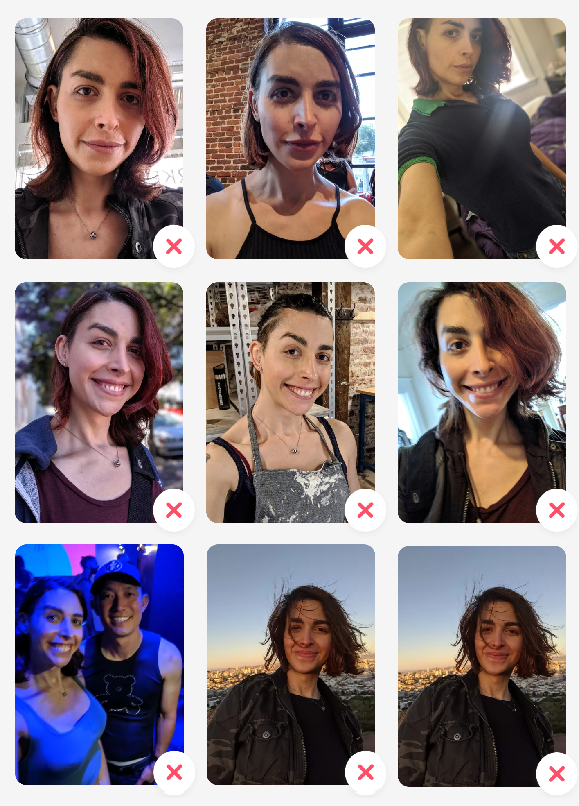

# Interview Project

In this interview you'll build a dating profile screen and use Bill Gates' photos as example data for demo.

This repository is a starting point for implementing an interview challenge. This should get you everything
you need to just start working on a react-native implementation.

The starter project was created using [these steps](https://reactnative.dev/docs/0.60/getting-started). Note that React-Native-CLI was used and not Expo. If you have any troubles with tooling then start there.

Implement the following features in the app using React Native and demo the app functionality using the ios simulator and the Android emulator.

Once you're finished with the implementation, record a screen capture demo of the requirements. If you
can, please walk us through your demo with a mic. You can use Quicktime "New screen recording" or any other
video screen capture system or [Loom](https://www.loom.com/).

Deliverable: Email us the following (please do not open a pull request):

-   Link to your code implementation on a public github repository
-   Video file for demo screen capture

Be sure to leave 5-10 minutes at the end to record and send your screen capture and send the Github link.
Please record any progress you have made. It's okay if you don't finish both phases.

## Tools & Dependencies

[yarn](https://classic.yarnpkg.com/en/docs/install)
[nodejs](https://nodejs.org/en/download/)
[xcode](https://apps.apple.com/us/app/xcode/id497799835?mt=12)

You may need to install the following dependencies, as described on https://reactnative.dev/docs/0.60/getting-started

```sh
brew install node
brew install watchman
sudo gem install cocoapods
```

## Steps to Get Started.

Shell 1 - Starting your mock API server

```sh
cd mock
yarn install
yarn run mock
# Server will now be running at http://localhost:3000
```

_Note_: Any data saved to the mock server will be saved to _mock/api/db.json_.

Shell 2 - you can run the iOS simulator and develop your app here

```sh
cd app
yarn install
npx pod-install
yarn run ios
```

## What We

### Phase 1

#### Requirements

-   Build a single screen for Viewing and Editing the Photos of a users profile. This should look like
    Tinder's Edit your Profile screen, which includes thumbnails of each photo in a grid of 3 wide by 3 high.
    
-   Rearrange photos
    -   The profile will show the photos in order. Give users a way to rearrange the order.
-   Remove photos
    -   Remove a photo from the profile.
-   Add new photo
    -   Add a new photo.
    -   You can hard code a URL of a photo from the internet in the event handling code or use the camera. Whatever works to get a new photo in the appropriate data format and display.
-   The above functionality should query a backend service. The service API is as defined below.
    -   This API is simulated at http://localhost:3000. See the mock directory above.
    -   Example data can be found with memberId 1. i.e. http://localhost:3000/member/1/photos

#### API Response Types

```typescript
interface APIMember {
    id: number;
    firstName: string;
    lastName: string;
    email: string;
}

interface APIPhotoBase {
    url: string;
    width: number;
    height: number;
    position: number;
    centerX: number;
    centerY: number;
}

interface APIPhoto = APIPhotoBase & {
    id: string;
    memberId: number;
}
```

#### API definition:

**GET /member/{memberId}/photos**

`curl http://localhost:3000/member/1/photos`

200 response:

```typescript
interface APIGetPhotosResponse = APIPhoto[];
```

**POST /member/{memberId}/photos**

`curl -H "Content-Type: application/json" -X POST http://localhost:3000/member/2/photos -d '{"url":"https://miro.medium.com/max/2000/1*KvhM-ArA5RkpYLi7L_Qtdw.jpeg","position": 1, "width": 2000,"height": 1000, "centerX": 1000, "centerY": 500}'`

Request Parameters:

```typescript
interface APIAddMemberPhotoRequest = APIPhotoBase
```

200 response type:

```typescript
interface APIAddMemberPhotoResponse = APIPhoto
```

**PUT /photos/{id}**

`curl -H "Content-Type: application/json" -X PUT http://localhost:3000/photos/dK4-OYy -d '{"url":"https://miro.medium.com/max/2000/1*KvhM-ArA5RkpYLi7L_Qtdw.jpeg","position": 2, "width": 2000,"height": 1000, "centerX": 1000, "centerY": 500}'`

Request Parameters:

```typescript
interface APIUpdateMemberPhotoRequest = APIPhotoBase
```

200 response type:

```typescript
interface APIUpdateMemberPhotoResponse = APIPhoto
```

**DELETE /photos/{id}**

`curl -X DELETE http://localhost:3000/photos/dK4-OYy`

200 response type:

```typescript
interface APIDeletePhotosResponse {}
```

If needed, additional documentation can be found at https://github.com/typicode/json-server

### Phase 2

Iterate on your initial implementation to include the following changes. This will improve
the profile by having each photo specify where in the photo the center is located. Scale and
translate the photo as necessary to put the photo's center in the middle of the display frame.

#### Requirements

-   Implement custom offset based on the center of each photo (denoted by `centerX` and `centerY` in the `APIPhoto` type).
-   Photos should be scaled accordingly to fill the frame when offset to center.
